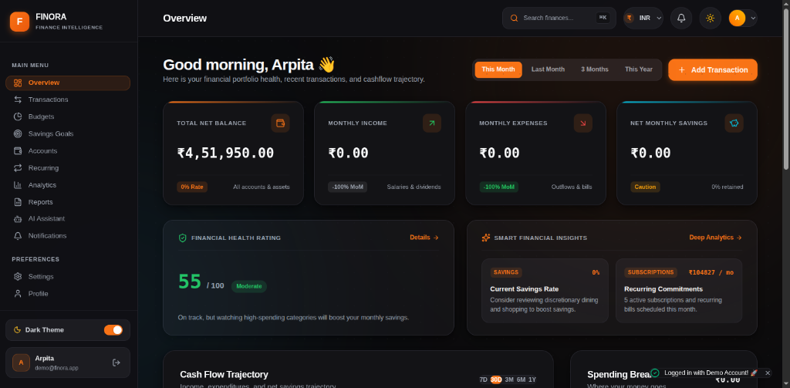
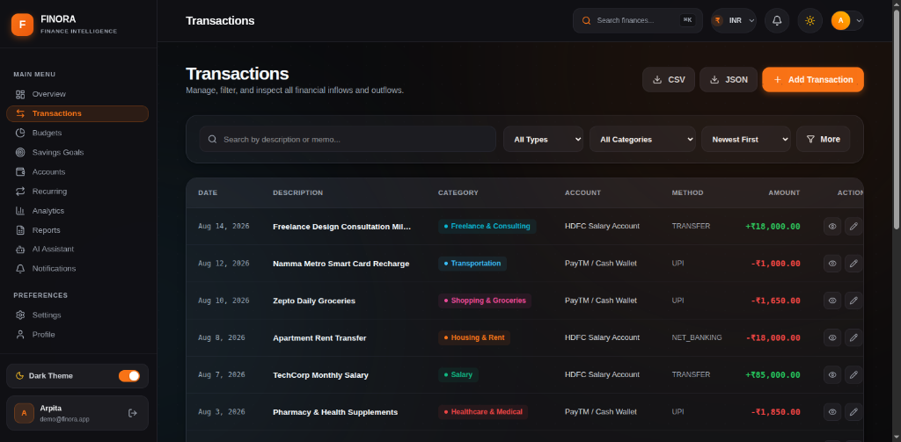
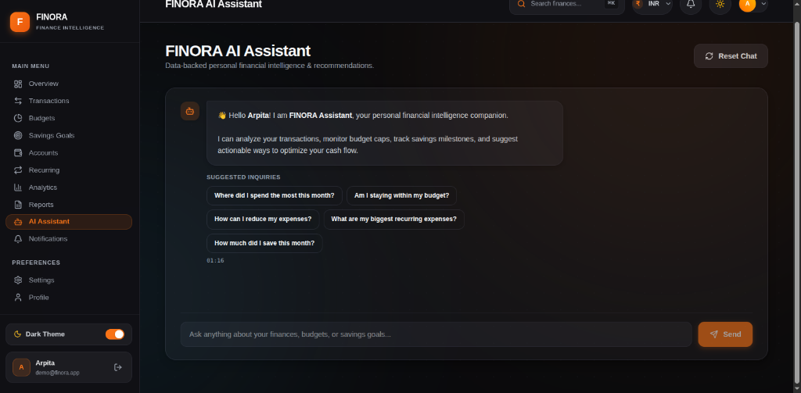
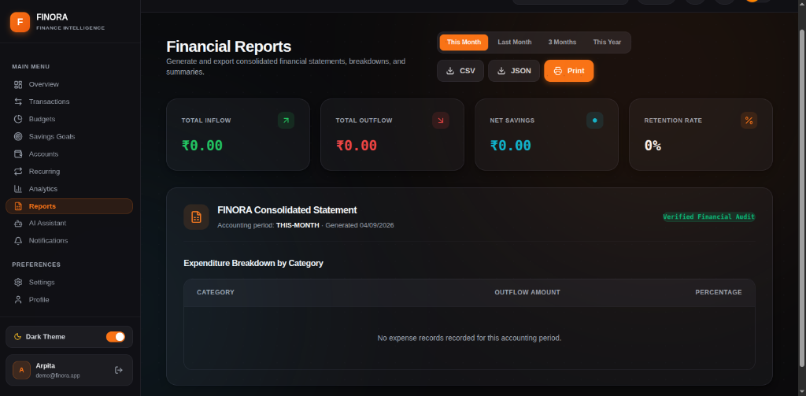
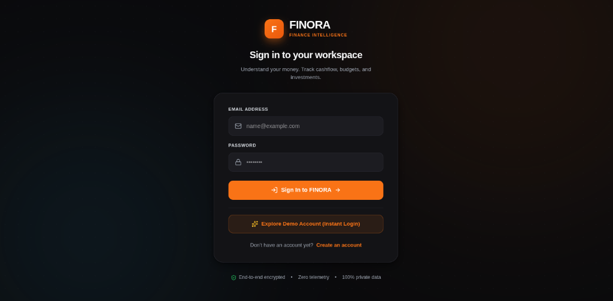

<div align="center">

# 💰 FINORA — Personal Finance & Wealth Intelligence

**A high-performance, full-stack personal finance application designed for cashflow optimization, category budgeting, savings milestone tracking, and algorithmic financial intelligence.**

[](https://finance-dashboard-frontend-sigma.vercel.app)
[](https://finance-dashboard-xlxs.onrender.com)
[](https://finance-dashboard-xlxs.onrender.com/api/docs)
[](https://neon.tech)
[](https://www.typescriptlang.org)
[](https://reactjs.org)

<br />

**[🌐 Live Demo App](https://finance-dashboard-frontend-sigma.vercel.app/login)** • **[📚 Swagger API Documentation](https://finance-dashboard-xlxs.onrender.com/api/docs)** • **[🩺 Health Check](https://finance-dashboard-xlxs.onrender.com/api/health)**

</div>

---

## 📸 Application Showcase

### 1. 📊 Executive Overview Dashboard
> Real-time net balance, monthly income/outflows, dynamic cash flow trajectory charts, health rating scorecard, and category allocation donuts.

<div align="center">
  
</div>

<br />

### 2. 💳 Transactions Ledger & Smart Filtering
> Instant full-text search, type toggles, multi-category chips, sorting by date/amount, recurring badges, and modal record drawers.

<div align="center">
  
</div>

<br />

### 3. 🤖 FINORA AI Financial Intelligence Assistant
> Context-aware conversational assistant providing automated spending breakdown audits, budget risk alerts, and custom financial advice.

<div align="center">
  
</div>

<br />

### 4. 📄 Consolidated Financial Statements & Export
> Multi-period financial audit statements with one-click export to CSV, JSON, and printer-ready PDF reports.

<div align="center">
  
</div>

<br />

### 5. 🔐 Secure Workspace Authentication
> High-security authentication with Argon2/bcrypt password hashing, JWT user session tokens, and instant 1-click Demo Account preview.

<div align="center">
  
</div>

---

## ✨ Core Features

- **💼 Portfolio & Multi-Account Management**: Connect Bank accounts, Digital Wallets, Investment portfolios, and Cash reserves with automatic balance synchronization.
- **🎯 Dynamic Category Budgets**: Set spending caps on Food, Housing, Commute, and Entertainment with live progress bars and alert thresholds.
- **🚀 Milestone Savings Goals**: Define target deadlines, log direct contributions, and track savings velocity towards emergency funds and major purchases.
- **🔄 Recurring Subscriptions & Invoices**: Auto-forecast upcoming bills, commitments, and detect upcoming billing cycles.
- **📈 Comprehensive Analytics**: 7-day day-of-week spend heatmaps, payment method breakdown, month-over-month trend comparisons, and retention metrics.
- **🌍 Multi-Currency System**: Native formatting support for **INR (₹)**, **USD ($)**, **EUR (€)**, and **GBP (£)** with Indian numbering system support.
- **🌓 Dark & Light Mode**: Smooth theme toggling with custom CSS variable design tokens and glassmorphism styling.
- **⚡ Decimal.js High-Precision Math**: Zero floating-point arithmetic errors across all monetary calculations.

---

## 🛠️ Tech Stack

### Frontend
- **Framework**: [React 18](https://react.dev/) + [Vite](https://vitejs.dev/)
- **Routing**: [React Router v7](https://reactrouter.com/)
- **Styling**: Tailwind CSS + Custom Design System Tokens
- **Icons**: [Lucide React](https://lucide.dev/)
- **Charts**: [Chart.js](https://www.chartjs.org/) + [React-Chartjs-2](https://react-chartjs-2.js.org/)
- **HTTP Client**: [Axios](https://axios-http.com/) with JWT interceptors
- **Deployment**: [Vercel](https://vercel.com)

### Backend
- **Runtime**: [Node.js](https://nodejs.org/) (v20+)
- **Language**: [TypeScript](https://www.typescriptlang.org/)
- **Framework**: [Express.js](https://expressjs.com/)
- **ORM**: [Prisma](https://www.prisma.io/)
- **Validation**: [Zod](https://zod.dev/)
- **Security**: [Helmet](https://helmetjs.github.io/), [Express Rate Limit](https://www.npmjs.com/package/express-rate-limit), [bcryptjs](https://www.npmjs.com/package/bcryptjs), [jsonwebtoken](https://www.npmjs.com/package/jsonwebtoken)
- **API Docs**: [Swagger UI Express](https://swagger.io/)
- **Testing**: [Jest](https://jestjs.io/) + [Supertest](https://www.npmjs.com/package/supertest)
- **Deployment**: [Render](https://render.com)

### Database & Cloud
- **Database**: [PostgreSQL 16](https://www.postgresql.org/) hosted serverless on [Neon](https://neon.tech/)

---

## 🚀 Quick Start (Local Development)

### Prerequisites
- Node.js >= 20.0.0
- npm or yarn
- PostgreSQL database (or free Neon PostgreSQL account)

### 1. Clone the repository
```bash
git clone https://github.com/arpitat09/finance-dashboard.git
cd finance-dashboard
```

### 2. Backend Setup
```bash
cd backend

# Install dependencies
npm install

# Configure environment variables
cp .env.example .env
# Edit .env and set your DATABASE_URL and JWT_SECRET

# Run database migrations & seed initial demo data
npx prisma db push
npm run prisma:seed

# Start backend dev server
npm run dev
```
> Backend API will start on: `http://localhost:5000`  
> Swagger Documentation: `http://localhost:5000/api/docs`

### 3. Frontend Setup
```bash
# In a new terminal window
cd frontend

# Install dependencies
npm install

# Start Vite dev server
npm run dev
```
> Frontend application will start on: `http://localhost:5173`

---

## 🔑 Demo Login Credentials

You can test the application instantly without manual registration:

| Field | Demo Credential |
|---|---|
| **Email** | `demo@finora.app` |
| **Password** | `Demo@12345` |

*(Or click **Explore Demo Account (Instant Login)** on the login screen)*

---

## 🧪 Testing

The backend includes a comprehensive Jest test suite covering monetary math, validation schemas, and user ownership isolation:

```bash
cd backend
npm test
```

---

## 📄 License

Distributed under the **MIT License**. See `LICENSE` for more information.

---

<div align="center">
  <b>Built with ❤️ by <a href="https://github.com/arpitat09">Arpita</a></b>
</div>
